# All Review Questions for Final
* As always, it is as paper exam, so a writing utensil is required.
* The exam is individual and talking will not be tolerated.
* On the day of your exam, please wait outside the classroom as we will be seating you for the final.
* The questions will be multiple choice, short answer, matching, fill in the blank, and a few where you will need to write code.
* Questions will focus on more recent topics, especially content covered after the midterm, but all topics are fair game.

### The final will be held on Monday, Apr 27, 2026 12:30 PM - 2:30 PM in **Brehm Lab 165**.


## mentimeter (Reading Code Questions)
### if statements (logic)
<ins>Question One</ins>

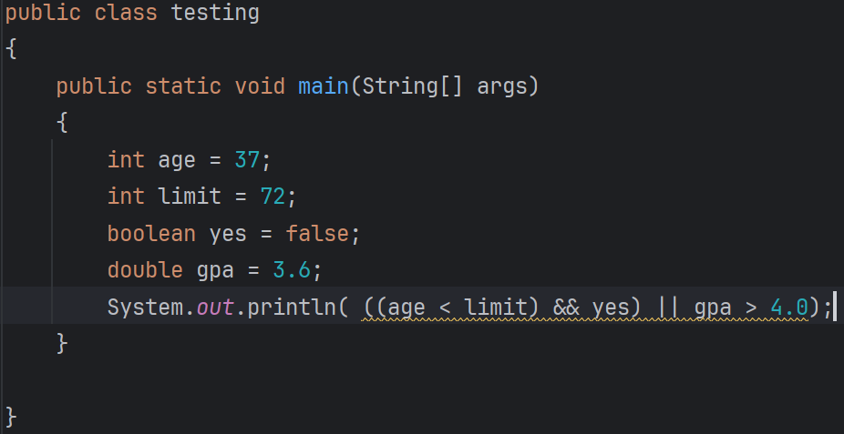

* **false**
  <br></br>

<ins>Question Two</ins>

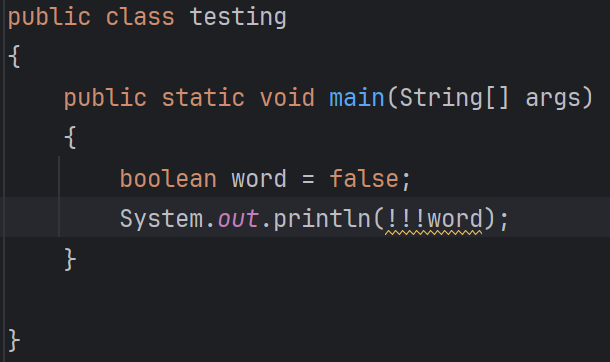

* **true**
  <br></br>

<ins>Question Three</ins>

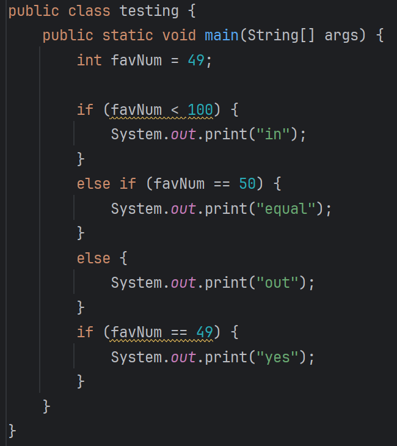

* **inyes**
  <br></br>

<ins>Question Four</ins>

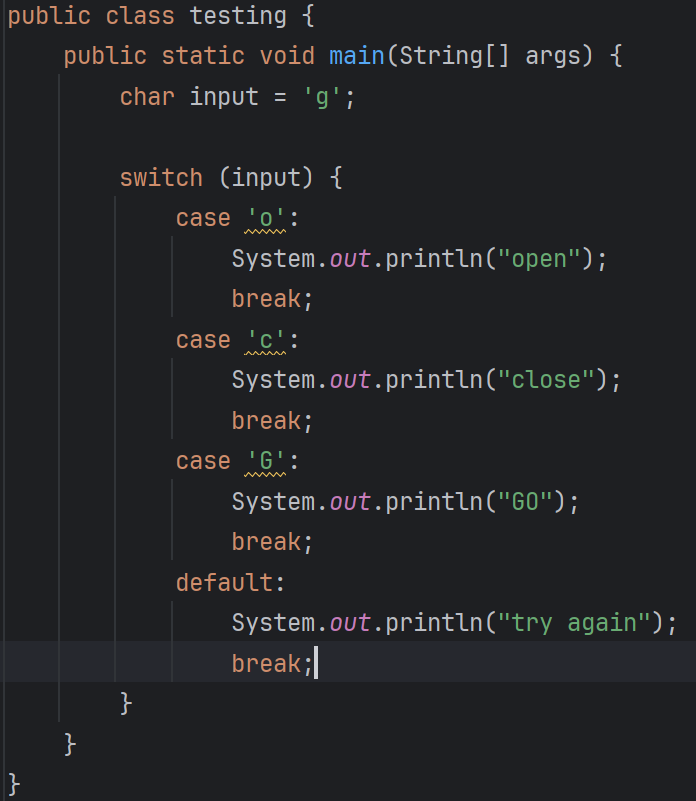

* **try again**
  <br></br>

### Loops
<ins>Question Five</ins>

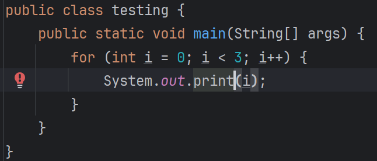

* **012**
  <br></br>

<ins>Question Six</ins>

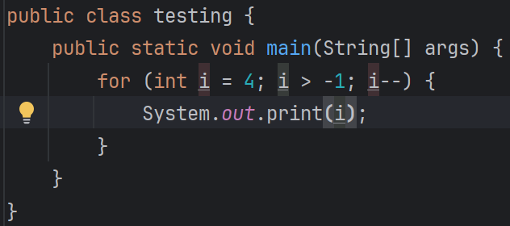

* **43210**
  <br></br>

<ins>Question Seven</ins>

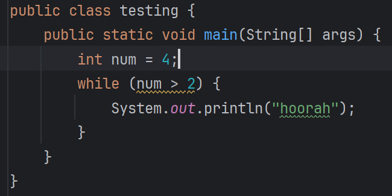

* **infinite loop**
  <br></br>

<ins>Question Eight</ins>

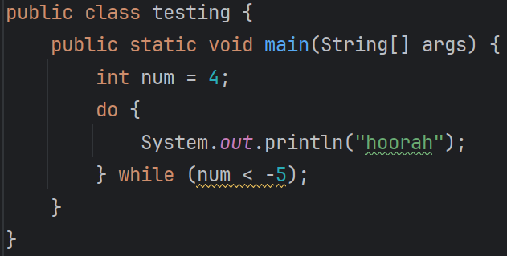

* **hoorah**
  <br></br>

<ins>Question Nine</ins>

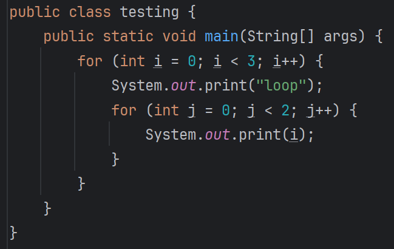

* **loop00loop11loop22**
  <br></br>

<ins>Question Ten</ins>

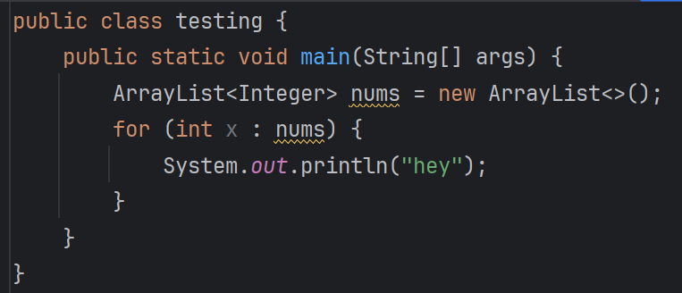

* **nothing gets printed out**
  <br></br>

<ins>Question Eleven</ins>

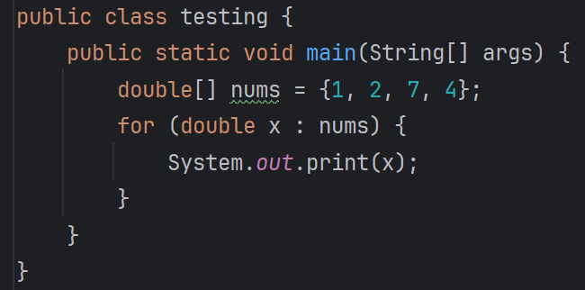

* **1.02.07.04.0**
  <br></br>

### Methods
<ins>Question Twelve</ins>

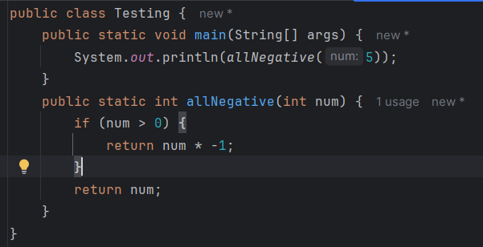

* **-5**
  <br></br>

<ins>Question Thirteen</ins>

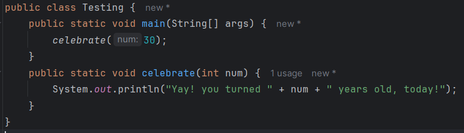

* **Yay! you turned 30 years old, today!**
  <br></br>

<ins>Question Fourteen</ins>

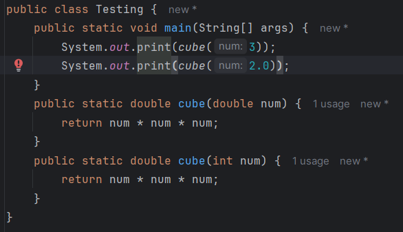

* **27.08.0**
  <br></br>

### File I/O
<ins>Question Fifteen</ins>

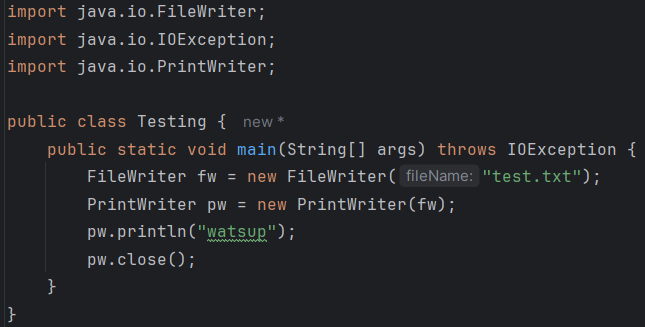

* **watsup**
  <br></br>

### Arrays & ArrayLists
<ins>Question Sixteen</ins>

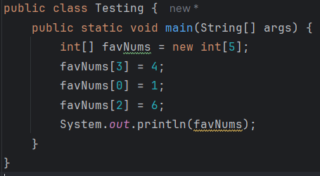

* **[I@7b23ec81**
  <br></br>

<ins>Question Seventeen</ins>

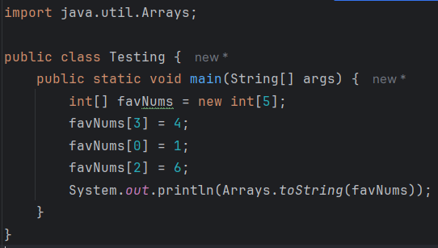

* **[1, 0, 6, 4, 0]**
  <br></br>

<ins>Question Eighteen</ins>

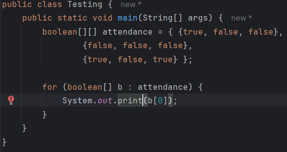

* **truefalsetrue**
  <br></br>

<ins>Question Nineteen</ins>

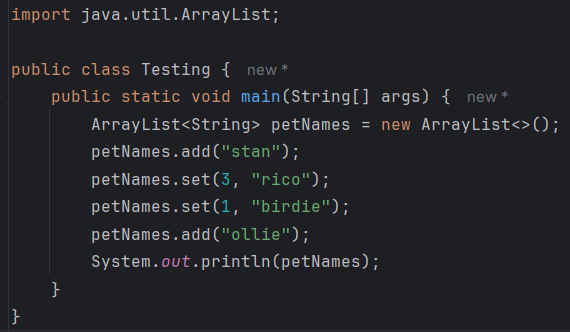

* **error**
  <br></br>

<ins>Question Twenty</ins>

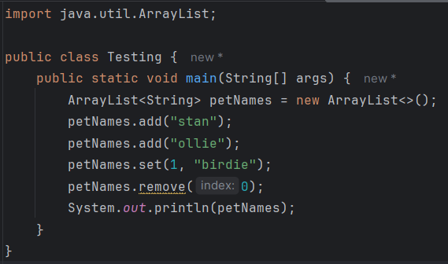

* **[birdie]**
  <br></br>

### Classes & Objects
<ins>Question Twenty-one</ins>

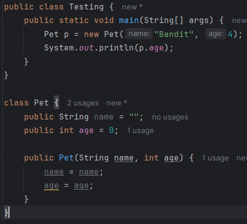

* **0**
  <br></br>

<ins>Question Twenty-two</ins>

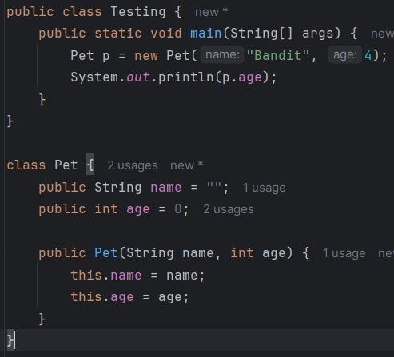

* **4**
  <br></br>

<ins>Question Twenty-three</ins>


* **error**
  <br></br>

<ins>Question Twenty-four</ins>

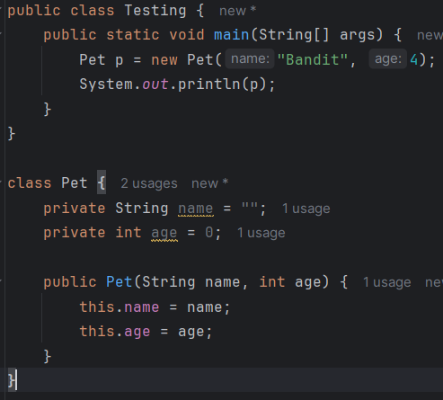

* **Pet@6acbcfc0**
  <br></br>

<ins>Question Twenty-five</ins>

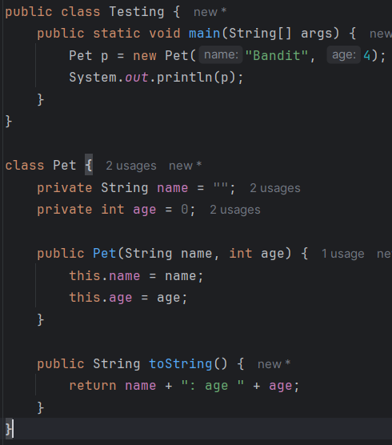

* **Bandit: age 4**
  <br></br>

## Writing Code Questions
### if statements (logic)

**QUESTION:**

Write the if statements and logic for the following:
A vault security system has several layers of security. In order to gain entry, a person must type in the correct `pin` (7), their fingerprint must match one in the system (`isValidFingerprint`), and their `name` must also be in the system (all valid names are stored in an ArrayList<String> called `names`). In this case, `access` will be granted. However, if the person does a retinal scan (`isValidRetina`) in addition to the previous checks, then they will be granted `specialAccess` as well.

Input variables (can assume they will get values):
```java
int pin;
boolean isValidFingerprint;
String name;
boolean isValidRetina;
ArrayList<String> names = new ArrayList<>();
```

Output variables (you should assign):

```java
boolean access;
boolean specialAccess;
```

**SOLUTION:**

```java
// given
int pin;
boolean isValidFingerprint;
String name;
boolean isValidRetina;
ArrayList<String> names = new ArrayList<>();

// need initialization
boolean access = false;
boolean specialAccess = false;

// solution
if ((pin == 7) && isValidFingerprint && (names.contains(name)))
{
    access = true;
    if (isValidRetina)
    {
        specialAccess = true;
    }
}
```


### Loops

**QUESTION:**

Add a loop and logic to the following code, so that:
* If the user types “up”, `value` is increased by one
* If the user types “down”, `value` is decremented by one
* If the user types “exit”, the loop is exited
* If `value` is less than 0, exit
* If `value` is greater than 5, exit
* You don’t need to do any error checking
  Provided code:
```java
Scanner scnr = new Scanner(System.in);
int value = 3;
String userInput = “”;
//[INSERT LOOP HERE]
    userInput = scnr.next();
```

**SOLUTION:**

```java
// given
Scanner scnr = new Scanner(System.in);
int value = 3;
String userInput = "";

// solution
while (!userInput.equals("exit") && value >= 0 && value <= 5)
{
    userInput = scnr.next();

    if (userInput.equals("up"))
    {
        value++;
    }
    else if (userInput.equals("down"))
    {
        value--;
    }
}
```


### Methods

**QUESTION:**

* Write a method that takes in a number of students
* Return the number of groups required to have an equal number of students in every group
* There must be a minimum of three groups
* Example input/output:
    * IN: 9 students / OUT: 3 groups
    * IN: 10 students / OUT: 5 groups
    * IN: 13 students / OUT: 13 groups

**SOLUTION:**

```java
public static int calcGroups(int numStudents)
{
    for (int i = 3; i <= numStudents; i++)
    {
        if ((numStudents % i) == 0)
        {
            return i;
        }
    }
    return 0;
}
```

**QUESTION:**

* Write a method header for a method that returns the price of an item, given its name and id number
* Make sure to use the most appropriate data types when possible

**SOLUTION:**

```java
public static double getItemPrice(String name, int idNum)
```

### Arrays

**QUESTION:**

* Add a line to the following code so the for loop sums all of the values in the array
* Add a line to calculate the average
* Add a line to store the average in the last index of the array

```java
double[] gpas = {3.4, 2.7, 3.8, 4.0, 0.0};
double sum = 0.0;
double avg = 0.0;
for(double gpa : gpas) {}
```

**SOLUTION:**

```java
// given
double[] gpas = {3.4, 2.7, 3.8, 4.0, 0.0};
double sum = 0.0;
double avg = 0.0;
for(double gpa : gpas)
{
    // solution
    sum = sum + gpa;
}
// solution
avg = sum / (gpas.length - 1);
gpas[(gpas.length - 1)] = avg;
```

### Classes & Objects

**QUESTION:**

* Create an object for a class called CellPhone
* Utilize a constructor that has the following parameters in the order described:
    1. An integer for the phone number (no area code)
    2. A boolean to indicate whether or not the phone is a smart phone
    3. A String to hold the brand of the phone

**SOLUTION:**

 ```java
CellPhone c1 = new CellPhone(8675309, true, "Samsung");

// also acceptable

int phoneNum = 8675309;
boolean isSmart = true;
String brand = "Samsung";

CellPhone c2 = new CellPhone(phoneNum, isSmart, brand);
```

**QUESTION:**

* Fill in the code for both constructors to initialize the variables for the following class
* The no-arg constructor should initialize the variables to a starting value
* The 3-arg constructor should assign initialize the variables to the parameter values

```java
public class Part
{
    private int partNo;
    private double weight;
    private String material;
    
    public Part()
    {
        
    }
    
    public Part(int partNo, double partWeight, String partMaterial)
    {
        
    }
}
```

**SOLUTION:**

```java
public class Part
{
    private int partNo;
    private double weight;
    private String material;
    
    public Part()
    {
        partNo = 0;
        weight = 0.0;
        material = "";
    }

    public Part(int partNo, double partWeight, String partMaterial)
    {
        this.partNo = partNo; // this keyword required due to names being the same
        weight = partWeight; // different names do not require the this keyword
        setMaterial(partMaterial); // assumes that a set method has been defined
    }
}
```